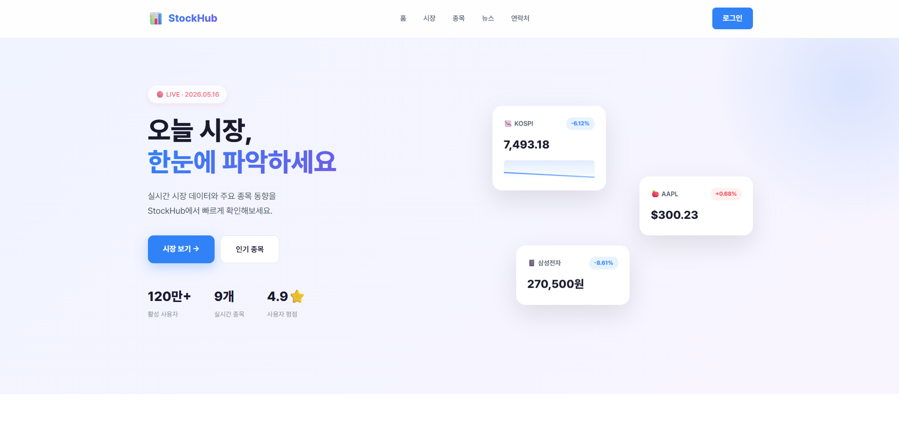

# My Stock Site

## 프로젝트 소개

주식 정보를 한눈에 확인할 수 있도록 제작한 웹사이트 프로젝트입니다.

사용자가 직관적으로 정보를 확인할 수 있도록
모던한 UI와 반응형 웹 디자인을 적용하였습니다.

---

## 개발 기간

2025.05

---

## 사용 기술

- HTML
- CSS

---

## 주요 기능

- 주식 정보 카드 UI
- 포트폴리오 섹션 구성
- 뉴스 섹션 구현
- 반응형 웹 디자인
- 모달 UI 구현
- 애니메이션 효과 적용

---

## 프로젝트 특징

- 카드형 레이아웃 기반 디자인
- 반응형 웹 지원
- 사용자 친화적인 인터페이스
- 부드러운 애니메이션 효과 적용

---

## 실행 방법

1. 프로젝트 다운로드
2. index.html 실행

---

## 프로젝트 화면

---

## 개발자

유성원